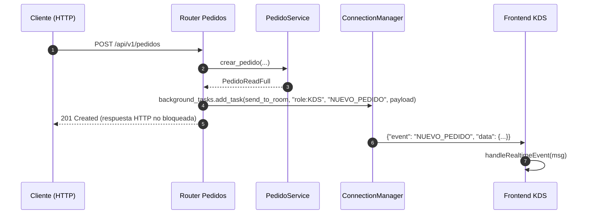
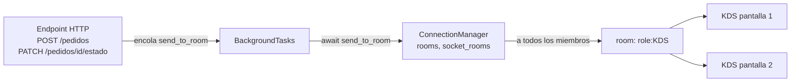
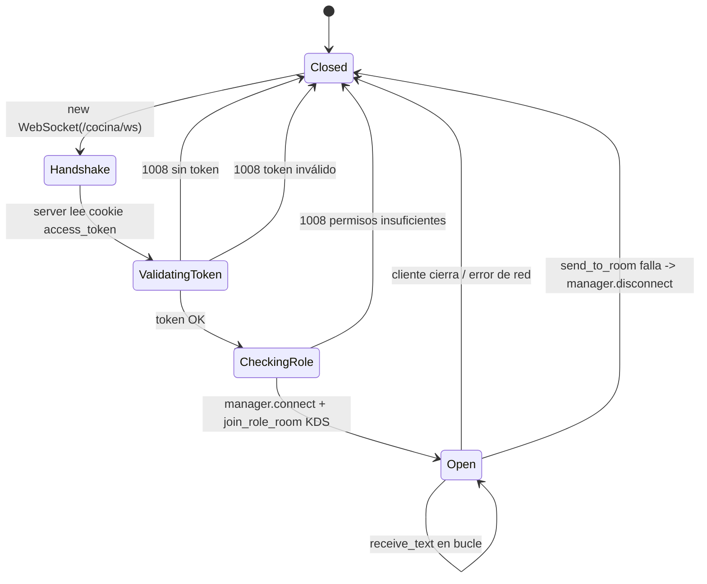
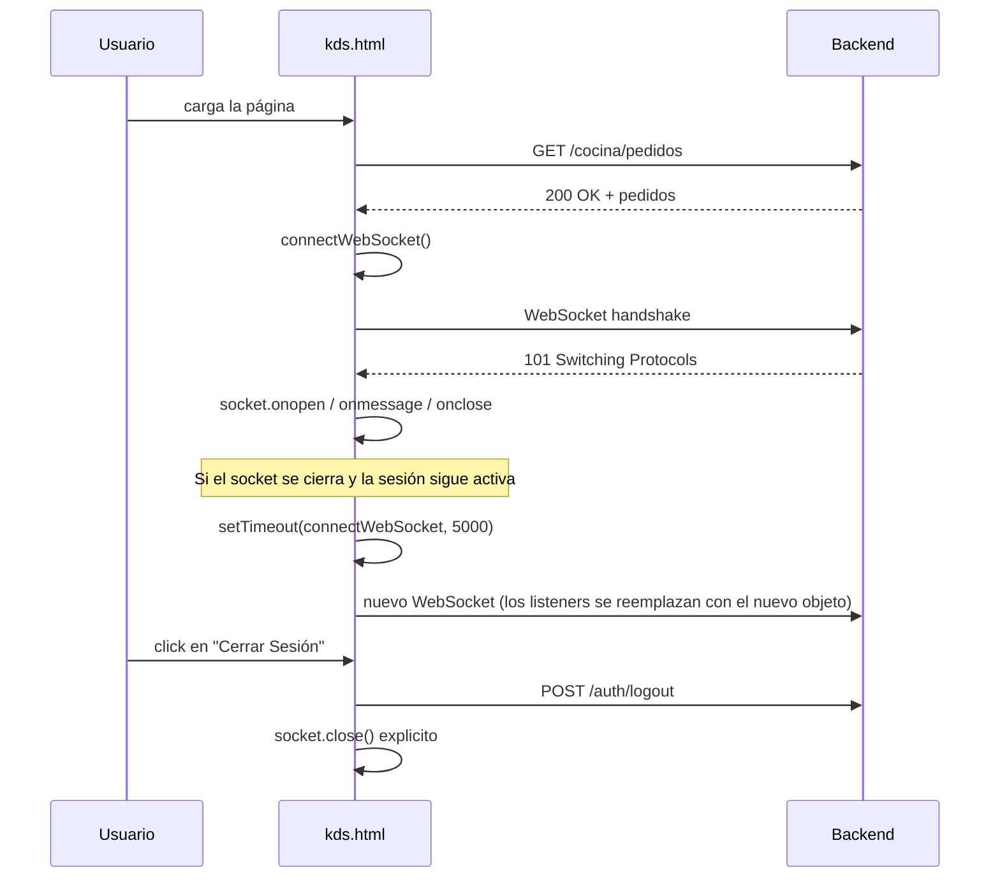
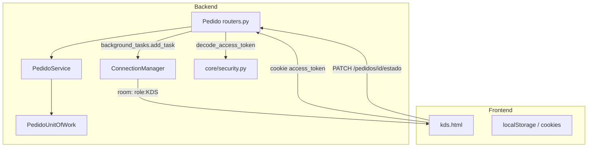

# WebSockets basados en Rooms

Documentación técnica de la implementación del sistema de WebSockets basado en rooms para el KDS (Kitchen Display System) y la sincronización de pedidos en tiempo real.

---

# Arquitectura actual de WebSockets

## Por qué se abandonó el broadcast general

En una primera iteración la entrega de eventos en tiempo real se concibió como un broadcast indiscriminado: cualquier cliente conectado recibía cualquier evento. Ese modelo quedó descartado porque:

* Filtrar en el cliente es caro y propenso a fugas de información.
* Conectar un cliente que no necesita el evento consume ancho de banda y CPU del servidor.
* No permite diferenciar pantallas funcionales (cocina vs. admin vs. repartidor) dentro de un mismo rol.

## Cómo funciona el sistema basado en rooms

El núcleo es una clase `ConnectionManager` (`app/core/websocket.py`) que mantiene dos estructuras en memoria:

* `rooms: dict[str, set[WebSocket]]` — mapea cada room a su conjunto de conexiones suscritas.
* `socket_rooms: dict[WebSocket, set[str]]` — mapea cada conexión al conjunto de rooms a las que está suscripta.

Una *room* es simplemente una clave string. Hoy se utiliza la convención `role:<CODIGO>` (por ejemplo `role:KDS`, `role:COCINA`). El endpoint de WebSocket suscribe al cliente a dos rooms:

* `role:<codigo_del_usuario>` — la room de su rol primario.
* `role:KDS` — la room funcional de la cocina, independientemente del rol.

Cuando un endpoint HTTP (creación de pedido, cambio de estado) necesita avisar, llama a `manager.send_to_room("role:KDS", "NUEVO_PEDIDO", payload)` y el manager serializa el mensaje y lo entrega a todos los miembros.

## Ventajas

* **Segmentación**: un cliente `CLIENT` no recibe eventos pensados para cocina.
* **Escalabilidad funcional**: agregar una nueva pantalla (delivery, admin) es agregar una nueva room y un `send_to_room` en el router correspondiente.
* **Limpieza predecible**: la desconexión del cliente se traduce en removerlo de todas sus rooms, sin sockets fantasma.
* **Tolerancia a fallos de envío**: si un `send_json` falla, el manager descarta la conexión y continúa con las demás.

## Flujo de un evento: Backend → Room → Frontend

La emisión se hace con `BackgroundTasks` para que la respuesta HTTP al cliente que originó el cambio (crear pedido, cambiar estado) no quede bloqueada por el broadcast.

## Qué room usa kitchen y por qué

Kitchen usa la room **`role:KDS`**. Es una room funcional, no atada a un rol de usuario: cualquier operador con rol `COCINA`, `ADMIN` o `PEDIDOS` queda suscripto a ella al abrir el WebSocket. La razón es que la pantalla del KDS puede ser operada por distintos perfiles, pero los eventos que debe recibir son los mismos (nuevos pedidos confirmados, cambios de estado).

## Cómo se evita que usuarios no relacionados reciban eventos innecesarios

* El handshake del WebSocket valida que el usuario pertenezca a `COCINA`, `ADMIN` o `PEDIDOS`. Si no, el servidor cierra con `1008` y nunca lo suscribe a ninguna room.
* Los routers HTTP que disparan eventos (`POST /pedidos`, `PATCH /pedidos/{id}/estado`) siempre apuntan a `role:KDS`, que es la única room que el frontend del KDS escucha.
* Un cliente `CLIENT` no tiene forma de recibir esos eventos: no le llega ningún `send_to_room` dirigido a otra room, y aunque abriera el endpoint WebSocket, el control de roles lo rechaza.

## Cómo se evita registrar listeners duplicados

El backend no registra listeners por evento: mantiene un único `ConnectionManager` *singleton* (`manager` global) y la membresía se expresa por room. No hay tabla de "eventos suscritos" por socket: si un socket está en la room `role:KDS`, recibe todo lo que esa room emita. No hay forma de duplicar la suscripción porque `_join_room` opera sobre `set`s.

En el frontend, `connectWebSocket()` en `kds.html` chequea `socket.readyState` antes de crear uno nuevo, así no se abren túneles duplicados al reconectar.

## Cómo se limpian las suscripciones

* `WebSocketDisconnect` (cliente cierra la pestaña, red caída, apagado de PC) → `manager.disconnect(websocket)` → recorre `socket_rooms[ws]` y elimina el socket de cada room, y luego borra la entrada del socket. Si una room queda vacía, también se elimina.
* `send_json` que falla → el manager llama a `disconnect(connection)` y libera la room.
* En el frontend, `handleLogout` llama a `socket.close()` explícitamente.

---

# Archivos modificados

## 1. `app/core/websocket.py`

### Responsabilidad

Es el núcleo del sistema. Define la clase `ConnectionManager` (rooms + suscripciones) y expone la instancia global `manager` que consumen los routers. No sabe nada de HTTP, JWT ni de lógica de negocio: solo administra túneles vivos.

### Flujo

* Mantiene dos diccionarios en memoria.
* `connect(websocket, role, user_id)` acepta el handshake y suscribe el socket a `role:<ROLE>`.
* `join_role_room(websocket, role_code)` agrega suscripciones adicionales (usado para sumarlo a `role:KDS`).
* `send_to_room(room, event_type, data)` arma `{"event": ..., "data": ...}` y lo entrega a todos los miembros; si alguno falla, lo descarta.
* `disconnect(websocket)` recorre las rooms del socket y lo remueve de cada una.

### Eventos

No emite ni procesa eventos de negocio. Solo transporta payloads genéricos `{"event": str, "data": dict}`.

### Rooms

Manipula dos rooms:
* `role:<codigo_del_rol>` — la room de rol, creada en `connect()`.
* `role:KDS` — la room funcional de cocina, agregada vía `join_role_room()` desde el router.

### Ciclo de vida

* **Apertura**: el `manager` no abre conexiones. Es el endpoint WebSocket del router quien llama a `manager.connect()` después de validar auth.
* **Registro de listeners**: no hay listeners — la suscripción se materializa al meter el `WebSocket` en el `set` de la room.
* **Eliminación de listeners**: `_leave_room` saca el socket del set de la room; `disconnect` lo aplica a todas las rooms del socket.
* **Cierre**: la desconexión es lógica (sockets muertos, errores de envío, handshake inválido). Cuando un `send_json` falla, el manager llama a `disconnect`.

### Relación con otros archivos

* `app/modules/dominio_3/Pedido/routers.py` — instancia `manager` y `get_connection_manager` para inyectar el manager en el endpoint WebSocket.
* `app/modules/dominio_3/Pedido/routers.py` — llama a `manager.send_to_room(...)` en `BackgroundTasks` desde `crear_pedido` y `cambiar_estado_pedido`.
* `app/core/security.py` — el router usa `decode_access_token` para validar el JWT antes de invocar `manager.connect()`.

---

## 2. `app/modules/dominio_3/Pedido/routers.py`

### Responsabilidad

Expone los endpoints HTTP y WebSocket del módulo de pedidos. Es el punto de contacto entre el negocio (`PedidoService`) y la red. Aquí se disparan los eventos hacia el KDS y se autentican los túneles WebSocket.

### Flujo

**Tráfico saliente (Backend → Room):**

* `POST /api/v1/pedidos` crea el pedido y agenda un `manager.send_to_room("role:KDS", "NUEVO_PEDIDO", ...)` como `BackgroundTasks`.
* `PATCH /api/v1/pedidos/{id}/estado` actualiza el estado, mapea el código de estado a un nombre de evento JS (`CONFIRMADO` → `PEDIDO_CONFIRMADO`, etc.) y emite `ESTADO_ACTUALIZADO` por defecto.

**Tráfico entrante (Frontend → Backend):**

* `WebSocket /api/v1/pedidos/cocina/ws`:
  1. Lee el token desde la cookie `access_token` (los WebSockets no pueden mandar `Authorization` header desde el navegador).
  2. Decodifica el JWT con `decode_access_token`.
  3. Valida que el usuario exista y que su rol esté en `["COCINA", "ADMIN", "PEDIDOS"]`.
  4. Acepta la conexión, llama a `manager.connect()` y a `manager.join_role_room(websocket, "KDS")`.
  5. Entra en `while True: await websocket.receive_text()` para mantener el túnel vivo.
  6. Al recibir `WebSocketDisconnect` o cualquier excepción, llama a `manager.disconnect(websocket)`.

* `GET /api/v1/pedidos/cocina/html-prueba` sirve el HTML estático de `app/templates/kds.html` para abrir el KDS sin levantar un frontend aparte.
* `GET /api/v1/pedidos/cocina/pedidos` devuelve los pedidos en estado `CONFIRMADO` o `EN_PREP` (lo que el KDS muestra al cargar).

### Eventos

| Origen | Evento | Destino |
|---|---|---|
| `POST /pedidos` | `NUEVO_PEDIDO` | `role:KDS` |
| `PATCH /pedidos/{id}/estado` | `PEDIDO_CONFIRMADO` | `role:KDS` |
| `PATCH /pedidos/{id}/estado` | `PEDIDO_EN_PREPARACION` | `role:KDS` |
| `PATCH /pedidos/{id}/estado` | `PEDIDO_EN_CAMINO` | `role:KDS` |
| `PATCH /pedidos/{id}/estado` | `PEDIDO_CANCELADO` | `role:KDS` |
| `PATCH /pedidos/{id}/estado` | `ESTADO_ACTUALIZADO` (fallback) | `role:KDS` |

### Rooms

* El router no se une a rooms; *emite* a la room `role:KDS` y administra qué sockets se unen a esa room desde el handshake del WebSocket.

### Ciclo de vida

* **Apertura de la conexión**: cuando el frontend hace `new WebSocket("/api/v1/pedidos/cocina/ws")`. El router corre las validaciones y llama a `manager.connect()`.
* **Registro de listeners**: tras validar, el router registra al socket en `role:<rol>` y `role:KDS`.
* **Eliminación de listeners**: en el `except WebSocketDisconnect` y `except Exception` del bucle.
* **Cierre**: `websocket.close(code=1008, reason=...)` ante token ausente/inválido/insuficiente; `manager.disconnect` cuando el cliente se va.

### Relación con otros archivos

* `app/core/websocket.py` — `manager` y `get_connection_manager` para inyectar el `ConnectionManager`.
* `app/core/security.py` — `decode_access_token` para validar el JWT del WebSocket.
* `app/core/deps.py` — `get_current_active_user` para endpoints HTTP protegidos y `require_role` en los `dependencies` de los routers.
* `app/modules/dominio_3/Pedido/service.py` — toda la lógica de negocio de los endpoints HTTP.
* `app/modules/dominio_3/Pedido/unit_of_work.py` — `PedidoUnitOfWork`, instanciado en `get_pedido_service`.
* `app/modules/dominio_1/usuario/unit_of_work.py` — `UsuarioUnitOfWork`, inyectado en el WebSocket para validar que el usuario siga existiendo.
* `app/templates/kds.html` — frontend del KDS; `GET /cocina/html-prueba` lo sirve en crudo.
* `main.py` — incluye el router con `prefix="/api/v1/pedidos"`, lo que define las URLs reales.

---

## 3. `app/modules/dominio_3/Pedido/service.py`

### Responsabilidad

Lógica de negocio de pedidos. Dentro del alcance de esta documentación, los cambios relevantes son:

* Normalización de estados canónicos (`ESTADOS`).
* FSM con transiciones restringidas por rol (`TRANSICIONES`).
* Auditoría por consola de cada transición de estado (logger `app.modules.dominio_3.Pedido.service`).
* Nuevo método `obtener_pedidos_cocina` que devuelve solo los pedidos en `CONFIRMADO` o `EN_PREP`, ordenados por ID.

### Flujo

* `cambiar_estado_pedido(...)` valida la transición contra `self.TRANSICIONES[rol][estado_actual]`, escribe el log de auditoría, persiste el cambio, registra en `HistorialEstadoPedido` y devuelve el pedido actualizado. Es el `PedidoService` (no el router) el que decide si la transición es legal.
* `obtener_pedidos_cocina(...)` filtra `CONFIRMADO` y `EN_PREP` (mapeados desde `ESTADOS["confirmado"]` y `ESTADOS["preparando"]`).

### Eventos

No emite eventos. La emisión se hace desde el router usando `manager.send_to_room` con el resultado de este servicio.

### Rooms

No participa del sistema de rooms.

### Ciclo de vida

N/A. Es lógica stateless por request, instanciada por request vía `get_pedido_service`.

### Relación con otros archivos

* `app/modules/dominio_3/Pedido/routers.py` — único consumidor.
* `app/modules/dominio_3/Pedido/unit_of_work.py` — la UoW que inyecta.
* `app/modules/dominio_3/Pedido/models.py` y `schemas.py` — entidades y DTOs.
* `app/modules/dominio_3/HistorialEstadoPedido/models.py` — registro de auditoría persistente.

---

## 4. `app/templates/kds.html`

### Responsabilidad

Frontend de prueba del KDS. Sirve como cliente real del WebSocket: abre el túnel, mantiene el estado local de pedidos, renderiza dos columnas (`Confirmados`, `En Preparación`) y refleja los eventos en tiempo real.

### Flujo

1. `window.addEventListener('load', fetchKdsOrders)`:
   * Hace `GET /api/v1/pedidos/cocina/pedidos`. Si responde 200, oculta el overlay de login y llama a `connectWebSocket()`. Si responde 401/403, muestra el overlay de login.
2. `handleLogin(event)`:
   * `POST /api/v1/auth/login` con `application/x-www-form-urlencoded` (OAuth2 password flow). El backend setea la cookie `access_token` HttpOnly.
3. `connectWebSocket()`:
   * Calcula el esquema (`ws:` o `wss:`) y abre `new WebSocket("/api/v1/pedidos/cocina/ws")`. No pasa token por query — la cookie viaja sola.
   * `socket.onmessage`: parsea `{"event", "data"}` y delega en `handleRealtimeEvent(msg)`.
   * `socket.onclose`: si la sesión sigue activa, reintenta en 5s.
4. `handleRealtimeEvent(msg)`:
   * Switch sobre `msg.event`:
     * `NUEVO_PEDIDO` → solo toast (el pedido está en `PENDIENTE`, no se muestra todavía).
     * `PEDIDO_CONFIRMADO` → push a `activeOrders` y toast.
     * `PEDIDO_EN_PREPARACION` → actualiza el estado del pedido localmente.
     * `PEDIDO_EN_CAMINO` → lo saca del array (pasó a delivery).
     * `PEDIDO_CANCELADO` → lo saca del array.
     * `ESTADO_ACTUALIZADO` → sincroniza según `data.estado_codigo`.
   * Llama a `renderBoard()`.
5. `advanceState(orderId, nextState)`:
   * `PATCH /api/v1/pedidos/{id}/estado` con el `estado_hacia` y un motivo. Refleja el cambio local de forma optimista, pero la fuente de verdad sigue siendo el evento de la room.
6. `renderBoard()`:
   * Filtra `activeOrders` por `estado_codigo` (`CONFIRMADO` → columna 1, `EN_PREP` → columna 2), actualiza contadores y dibuja las cards con `createOrderCard`.
7. `handleLogout`:
   * `POST /api/v1/auth/logout`, cierra el socket manualmente, limpia `activeOrders` y vuelve a mostrar el overlay de login.

### Eventos

| Evento recibido | Acción |
|---|---|
| `NUEVO_PEDIDO` | Toast informativo. No agrega a la UI (estado `PENDIENTE`). |
| `PEDIDO_CONFIRMADO` | Push al array + toast. |
| `PEDIDO_EN_PREPARACION` | Mutación local del estado + toast. |
| `PEDIDO_EN_CAMINO` | Quitar del array + toast. |
| `PEDIDO_CANCELADO` | Quitar del array + toast. |
| `ESTADO_ACTUALIZADO` | Sincronización genérica según `estado_codigo`. |

No emite eventos al servidor; el KDS solo dispara acciones vía HTTP (`PATCH /pedidos/{id}/estado`).

### Rooms

* **Room consumida**: `role:KDS` (lo recibe implícitamente al handshake, ya que el backend lo suscribe).
* **Cómo se une**: al abrir el WebSocket. El backend decide la suscripción, no el cliente.
* **Por qué**: porque KDS necesita ver los nuevos pedidos y los cambios de estado de los pedidos que ya está cocinando.

### Ciclo de vida

* **Apertura de la conexión**: tras `fetchKdsOrders` 200-OK o tras login exitoso. Antes de eso, `socket` es `null` y `connectWebSocket` no corre.
* **Registro de listeners**: `socket.onopen`, `socket.onmessage`, `socket.onclose`, `socket.onerror`. Como `socket` es un singleton en el módulo, no se acumulan listeners al reconectar (se reemplaza el objeto entero).
* **Eliminación de listeners**: al reconectar, el `WebSocket` anterior es descartado por el garbage collector junto con sus handlers. Al logout, `socket.close()` cierra el túnel.
* **Cierre**: `socket.close()` explícito en `handleLogout`, o `setTimeout(connectWebSocket, 5000)` en `onclose` para reintentos.

### Relación con otros archivos

* `app/modules/dominio_3/Pedido/routers.py`:
  * `GET /api/v1/pedidos/cocina/pedidos` para el fetch inicial.
  * `WebSocket /api/v1/pedidos/cocina/ws` para la conexión.
  * `GET /api/v1/pedidos/cocina/html-prueba` para servirse a sí mismo.
  * `PATCH /api/v1/pedidos/{id}/estado` para las transiciones.
* `app/modules/dominio_3/Pedido/service.py` — fuente de la FSM que valida las transiciones.
* `app/modules/dominio_1/usuario/routers.py` — expone `POST /auth/login` y `POST /auth/logout`.

---

## 5. `seed.py`

### Responsabilidad

Crea las cuentas de prueba necesarias para que el flujo del WebSocket tenga usuarios válidos. Sin estos usuarios, no hay forma de loguearse en el KDS y abrir el túnel.

### Flujo

Dentro de la función `seed()`, se crean (si no existen) los siguientes usuarios con sus roles:

| Email | Rol | Password | Uso |
|---|---|---|---|
| `admin@foodstore.com` | `ADMIN` | `admin123` | Admin general |
| `cocina@foodstore.com` | `COCINA` | `cocina123` | Login en el KDS |
| `pedidos@foodstore.com` | `PEDIDOS` | `pedidos123` | Gestor de pedidos (puede abrir el KDS) |
| `stock@foodstore.com` | `STOCK` | `stock123` | Gestor de stock |
| `cliente@foodstore.com` | `CLIENT` | `cliente123` | Cliente para crear pedidos |

Adicionalmente se ajustó el `orden` de los estados terminales: `ENTREGADO` pasó a `orden=4` y `CANCELADO` a `orden=5` (antes estaban en 5 y 99). Esto no afecta al WebSocket directamente, pero acompaña el cambio de FSM.

### Eventos

No participa.

### Rooms

No participa.

### Ciclo de vida

Corre una sola vez al ejecutar `python seed.py`. Idempotente: chequea si el usuario existe antes de crearlo.

### Relación con otros archivos

* `app/modules/dominio_1/usuario/models.py` — modelo `Usuario` y `roles_db`.
* `app/core/security.py` — `hash_password` para hashear las credenciales.
* Consumidores: `app/modules/dominio_3/Pedido/routers.py` valida contra estos usuarios al abrir el WebSocket; `app/templates/kds.html` los usa para el login.

---

# Diagramas

## Flujo Backend → Room → Frontend

## Apertura y cierre de la conexión WebSocket

## Registro y limpieza de listeners (Frontend)

## Interacción entre hooks, stores, servicios y componentes

---

# Cómo extender el sistema

## Agregar una nueva room

1. Definir la convención de nombre (recomendado: `role:<CODIGO>` o `<funcional>:<CODIGO>`).
2. En el router del WebSocket, después de `manager.connect(...)`, llamar a `manager.join_role_room(websocket, "<CODIGO>")` para los clientes que deban escucharla.
3. En los routers HTTP que necesiten emitir, usar `manager.send_to_room("role:<CODIGO>", "<NOMBRE_EVENTO>", payload)`.

## Agregar un nuevo evento

1. En el router HTTP, definir el `BackgroundTasks.add_task(manager.send_to_room, "room:...", "NOMBRE_EVENTO", payload)`.
2. En `kds.html` (o el frontend que corresponda), agregar un branch en `handleRealtimeEvent(msg)` para el nuevo `event`.

## Reutilizar la arquitectura

* El `ConnectionManager` no depende de FastAPI más allá de `WebSocket`. Es trivial moverlo a otro proyecto.
* El handshake de validación (token + rol) es local al endpoint WebSocket. Para una nueva pantalla, copiar el patrón y ajustar la lista de roles permitidos.
* La convención de payloads `{"event": str, "data": dict}` es estable. Mantenerla para no romper el switch del frontend.
